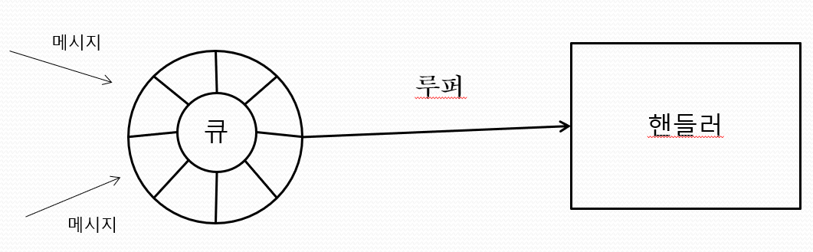

## 루퍼 (Looper)

**메시지큐 (Message Queue)**: 메시지가 저장되는 장소. 

**메시지나 Runnable 객체** : 일단 큐에 저장되고 들어온 순서대로 순차적으로 처리됨

**루퍼 (Looper)**: 메시지 큐에서 메시지를 꺼내어 핸들러로 전달. 

**루퍼**는 무한히 실행되는 메시지 루프를 통해 큐에 메시지가 들어오는지 감시하며, 들어온 메시지를 처리할 핸들러를 찾아 `handleMessage` 메서드를 호출합니다.

**UI를 관리하는 메인 스레드** 기본적으로 루퍼를 가짐

**계산을 주로 수행하는 작업 스레드**는 기본적으로 루퍼를 가지지 않으며 run  메서드의 코드만 실행하고 종료됨

**작업 스레드는 디폴트 루퍼가 없음** 루퍼를 직접 생성하고 실행시켜야 메시지를 받을 수 있는데 이때 루퍼의 다음 메서드를 호출함
static void prepare()
static void loop()
void quit()

**Prepare**는 현재 스레드를 위한 루퍼를 준비함

**loop**  메서드는 큐에서 메시지를 꺼내 핸들러로 전달하는 loop를 실행하고, 루프는 quit 메서드가 호출되어 루프를 종료할 때까지 무한 반복됨

